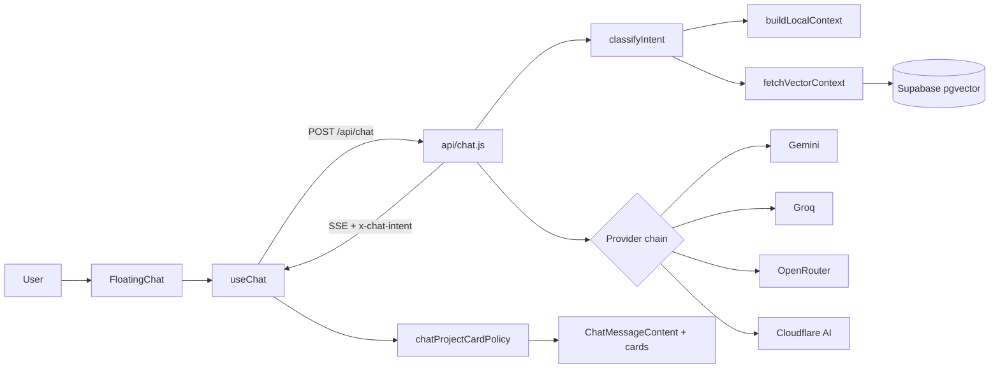

# Shizu0n CV | Portfolio + AI Chat

Live: https://shizu0n.vercel.app


Authorial portfolio built with React + TypeScript, visual storytelling, technical SEO, AI chat with SSE streaming, RAG over Supabase pgvector, and context-aware project card policy.

## Contents

- [Overview](#overview)
- [Stack and Tooling](#stack-and-tooling)
- [Architecture](#architecture)
- [Intelligent Chat Flow](#intelligent-chat-flow)
- [Core Features](#core-features)
- [Project Metrics](#project-metrics)
- [Prerequisites](#prerequisites)
- [Local Setup](#local-setup)
- [Scripts](#scripts)
- [Environment Variables](#environment-variables)
- [Security](#security)
- [Deployment](#deployment)
- [Engineering Practices](#engineering-practices)
- [Author](#author)
- [License](#license)

## Overview

Project goals:

- showcase Paulo Shizuo's technical profile and projects with a strong visual narrative;
- provide an interactive AI-based exploration experience;
- keep the codebase scalable, testable, and secure for continuous evolution.

This repository goes beyond a traditional portfolio page: it includes a serverless backend, a knowledge pipeline, and automated tests to keep chat behavior deterministic.

## Stack and Tooling

### Frontend

- React 19
- TypeScript (strict)
- Vite 7
- Framer Motion 12
- Lenis
- Tailwind CSS 4

### Backend and API

- Vercel Functions (`api/chat.js`, `api/health.js`)
- Node.js runtime
- Server-Sent Events (streaming)

### AI and RAG

- `@google/generative-ai` (Gemini)
- Groq API
- OpenRouter API
- Cloudflare Workers AI
- Supabase (`@supabase/supabase-js`, `@supabase/ssr`)
- PostgreSQL + pgvector (migrations in `supabase/migrations`)

### Data and Knowledge

- `data/chatbot/*.json` (profile, projects, recommendations, evals)
- `data/portfolio-knowledge.json` (consolidated runtime artifact)
- `scripts/build-chatbot-knowledge.js`
- `scripts/validate-chatbot-knowledge.js`
- `scripts/ingest.js`

### Quality, Security, and QA

- ESLint
- Prettier
- TypeScript type-check
- Vitest
- Playwright
- `scripts/security-check.js` (secret scan and unsafe `VITE_` usage checks)

### Infrastructure and Supporting Tools

- Vercel (deployment)
- Graphify (architecture mapping)

## Architecture

```text
src/
  App.tsx
  index.css
  main.tsx
  components/
    Nav.tsx
    ScrollProgress.tsx
    FloatingChat.tsx
    ChatMessageContent.tsx
    chatProjectCatalog.ts
    chatProjectCardPolicy.ts
    Footer.tsx
  contexts/
    TranslationContext.tsx
    GitHubContext.tsx
  hooks/
    useChat.ts
    useContactForm.ts
  sections/
    HeroSection.tsx
    AboutSection.tsx
    SkillsSection.tsx
    ProjectsSection.tsx
    ContactSection.tsx

api/
  chat.js
  health.js
  _security.js

data/
  chatbot/
    evals.json
    profile.json
    projects.manual.json
    recommendations.json
  chatbot-prompt.txt
  portfolio-knowledge.json

scripts/
  build-chatbot-knowledge.js
  validate-chatbot-knowledge.js
  ingest.js
  security-check.js

supabase/
  migrations/
  config.toml
```

### Main layers

- App shell: providers (i18n + GitHub), fixed navigation, five sections, and floating chat widget.
- Chat state and streaming: `useChat.ts` resolves API URLs, parses SSE, and stores `x-chat-intent`.
- Card policy: `chatProjectCardPolicy.ts` decides card visibility from context + intent.
- Project catalog: `chatProjectCatalog.ts` centralizes aliases, stacks, and card metadata.
- Chat API: `api/chat.js` classifies intent, builds context, and executes provider fallback.
- Security layer: `_security.js` handles CORS, headers, and log sanitization.

## Intelligent Chat Flow



## Core Features

- Editorial interface with motion designed for reading rhythm and storytelling.
- Fixed navigation with active section highlighting.
- Accessibility skip link.
- Technical SEO with JSON-LD in `App.tsx`.
- About section powered by GitHub stats with 5-minute local cache.
- Contact form with EmailJS + automatic `mailto:` fallback.
- PT/EN chat with contextual suggestions and real-time streaming.
- Context-aware project card policy based on user intent and explicit mentions.
- Baseline protections: rate limiting, response cache, embedding cache, and anti-jailbreak checks.

## Project Metrics

Technical snapshot (2026-04-17):

### Product and knowledge

- 5 projects in the official chatbot catalog.
- 26 total aliases in `projects.manual.json`.
- 93 runtime chunks in the knowledge artifact.
- 23 project aliases and 86 stack aliases for classification/context routing.

### Quality and testing

- 10 unit tests for extraction/card-policy rules.
- 5 UI scenarios validating card behavior in chat.

## Prerequisites

- Node.js 20+
- npm 10+

## Local Setup

```bash
npm install
npm run dev
```

Common URLs:

- local app: `http://localhost:3000`
- production preview: `http://localhost:4173`

To simulate serverless functions locally:

```bash
npx vercel dev
```

## Scripts

```bash
# Development
npm run dev
npm run build
npm run preview

# Quality
npm run type-check
npm run lint
npm run lint:fix
npm run format
npm run format:check
npm run security:check

# Tests
npm run test
npm run test:chat-cards

# Knowledge pipeline
npm run knowledge:build
npm run knowledge:validate
npm run knowledge:ingest

# Utilities
npm run clean
```

## Environment Variables

Create a `.env` file at the project root.

Critical rule: any variable prefixed with `VITE_` is public in the frontend bundle. Never put secrets in `VITE_` variables.

```env
# Frontend
VITE_EMAILJS_SERVICE_ID=your_service_id
VITE_EMAILJS_TEMPLATE_ID=your_template_id
VITE_EMAILJS_PUBLIC_KEY=your_public_key
VITE_CHAT_API_URL=http://localhost:3000

# Backend CORS
ALLOWED_ORIGINS=https://shizu0n.vercel.app,http://localhost:3000

# AI (primary)
GEMINI_API_KEY=your_gemini_api_key_here

# Supabase RAG
SUPABASE_URL=https://your-project-ref.supabase.co
SUPABASE_SERVICE_ROLE_KEY=your_supabase_secret_or_service_role_key

# AI fallbacks (optional)
GROQ_API_KEY=gsk_your_groq_key_here
OPENROUTER_API_KEY=sk-or-your_openrouter_key_here
CF_ACCOUNT_ID=your_cloudflare_account_id_here
CF_WORKERS_AI_TOKEN=your_cloudflare_workers_ai_token_here
```

## Security

Implemented controls:

- CORS with configurable allowlist.
- Security headers on backend routes.
- Log sanitization to avoid leaking secrets.
- IP rate limiting (`10 req/min`).
- Payload and history size limits.
- Basic jailbreak attempt detection.

Recommended pre-merge/deploy checklist:

```bash
npm run security:check
npm run type-check
npm run test:chat-cards
npm run build
```

## Deployment

- Primary platform: Vercel.
- Frontend bundled with Vite.
- API in `api/` served as Vercel Functions.
- Health endpoint: `GET /api/health`.

## Engineering Practices

- domain-based separation (`components`, `sections`, `hooks`, `contexts`, `api`, `scripts`);
- presentation components decoupled from chat business/policy rules;
- explicit typing for chat messages and state;
- dedicated scripts for knowledge build/validation/ingestion;
- critical rule coverage with unit tests + UI scenario tests;
- periodic architecture observability with Graphify.

## Author

**Paulo Shizuo Vasconcelos Tatibana**

- GitHub: https://github.com/Shizu0n
- LinkedIn: https://www.linkedin.com/in/paulo-shizuo/
- Portfolio: https://shizu0n.vercel.app

## License

MIT. See `LICENSE` for details.


